# ŠTO ČINI ZVUK?

## OSNOVE ZVUKA

### LITERATURA
- McAdams, S. (1999) — Perspectives on the Contribution of Timbre to Musical Structure: https://sites.music.columbia.edu/cmc/courses/g6610/fall2011/week4/McAdams-timbre-structure.pdf (VIDJETI izvori/izvor1.md)
- Yost, W. A. (2009) — Pitch Perception: https://www.researchgate.net/publication/40026915_Pitch_Perception (VIDJETI izvori/izvor2.md)
- Zwicker, E. (1984) — Psychoacoustics: Facts and Models: https://books.google.hr/books?hl=hr&lr=&id=WLvtCAAAQBAJ&oi=fnd&pg=PA1&dq=Zwicker,+E.+(1984)+%E2%80%94+Psychoacoustics:+Facts+and+Models&ots=kKsBfJ7pRz&sig=6Lg1Y9O-LwgZ49TeUk5QTPu3KFQ&redir_esc=y#v=onepage&q&f=false  (VIDJETI izvori/izvor3.md)

### 1. **Frekvencija ili pitch**
- rate at which a sound completes a cycle
- brzina kojom zvučni val izvrši jedan ciklus
- oznaka: f
- mjerna jedinica: Hz (jedan ciklus po sekundi)

  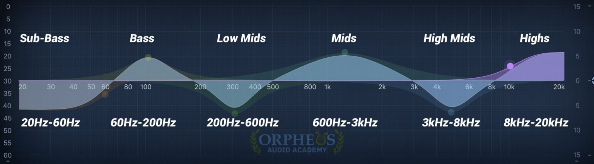

  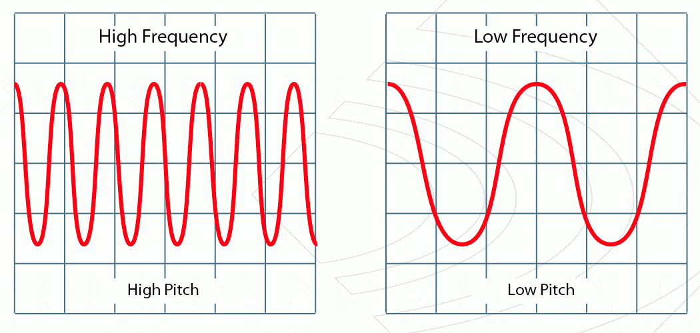

### 2. **Wavelength ili valna duljina**
- fizička verzija frekvencije
- duljina izmedju dva vrha vala
- oznaka: lambda, mjerna jedinica: m
- V = lambda * f
- veća frekvencija = manja valna duljina

  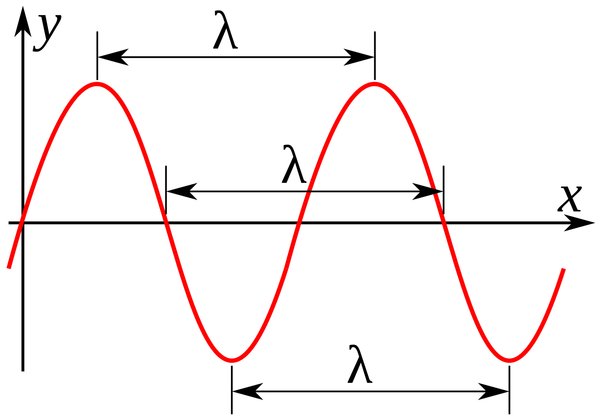

### 3. **Amplituda ili intenzitet/jačina** 
- jačina vala
- percepcija glasnoće
- mjerna jedinica: dB
- primjer: šapat - mala amplituda, eksplozija - velika amplituda

  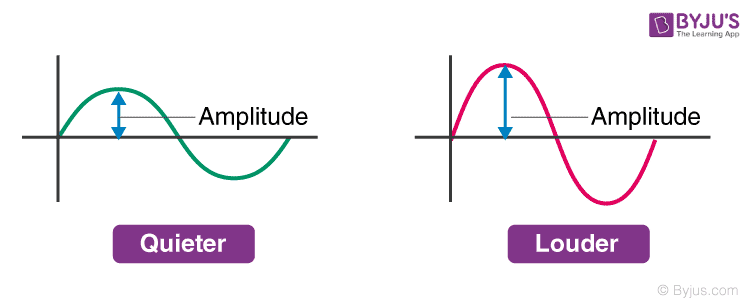

### 4. **Timbre ili boja zvuka**
- kako dva različita glazbala iako imaju istu jačinu i sviraju istu notu i dalje zvuče različito
- Ton čini mnogo različitih pitcheva: subtonovi (nzi u pitchu od osnovnog), overtonovi (vii u pitchu od osnovnog)
- subtonovi + overtonovi = harmonici
- harmonici su dodatne frekvencije koje prate osnovni ton i daju boju zvuka
- "potpis" (signature) zvuka

  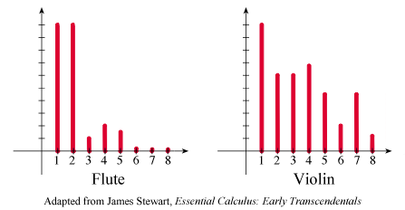

### 5. **ADSR ili Envelope**
- **Attack:** koliko brzo zvuk postigne peak volume nakon što je zvuk aktiviran, slabiji znači da je u pitanju neki ambijentni zvuk tipa violina, jači znači da je full blown attack tipa bubanj, metak, eksplozija, hitac...
- **Decay:** koliko brzo zvuk padne na odrzivi/konstantni volume nakon peaka
- **Sustain:** koliko dugo traje konstanti volume (zvuk) koji sjedi nakon decaya, obično najdulji dio, neka odrziva faza
- **Release:** nakon što se zvuk prekine, koliko mu dugo treba da se skroz zgadi, svojevrsna jeka

  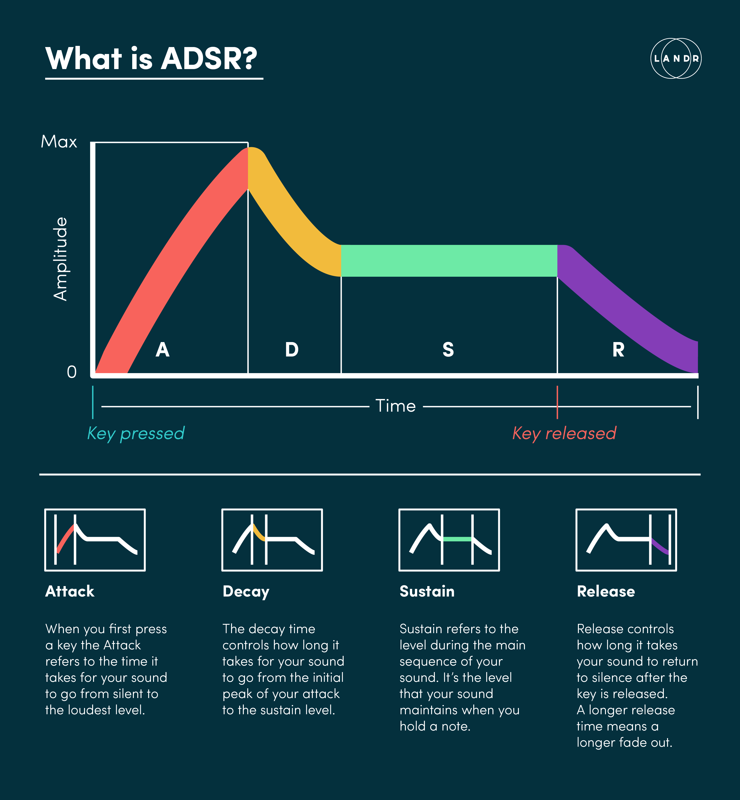

### 6. **Duration (trajanje)**
- duljina trajanja zvuka

  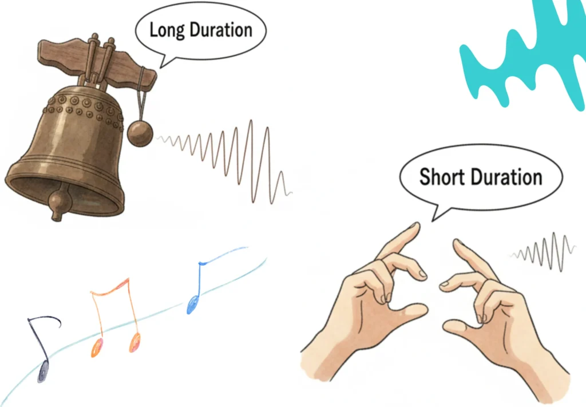

 

## PRETVARANJE ZVUKA U ZNAČAJKE ZA ML

Zvuk je za računalo samo vremenski niz brojeva (audio signali).
 
Da bi ML model mogao raspoznati uzorke u zvuku, iz tog signala je potrebno izvući značajke (feature). (VIDJETI izvori/izvor4.md)
 
 
Svaka ML značajka predstavlja neku informacija o osnovnim karakteristikama zvuka:
- frekvenciji
- amplitudi
- tonu (timbru)
- vremenskoj strukturi (envelope/duration)

**Flow pretvaranja osnovnih značajki zvuka u ML značajke:**
Zvuk --> osnovne karakteristike (f, A, ADSR, T...) --> FFT --> frekvencijska reprezentacija (spektar) --> spektogram (frekevencije kroz vrijeme) --> ekstrakcija značajki --> ML značajke --> ML model

**Tipovi značajki:**
- vremenske (time-domain): dobivaju se iz čitih podataka, dakle prije bilo kakve transforamcije tipa FFT-a (RMS, ZCR)
- frekvencijske (frequency domain): dobivaju se nakon transformacije i gledaju spektar (spectral centroid; bandwith; rolloff, flux)
- vremensko-frekvencijske: koriste spektogram i moguce dodatne obrade (MFCC)

 

### 1. Fourier Transform

**Što radi?**
- pretvara zvuk iz vremenske domene u frekvencijsku
- pokazuje koje frekvencije postoje u zvuku i koliko su jake

**Što nam je potrebno od osnovnih karakteristika?**
- frekvencija --> koje frekvencije postoje u signalu
- amplituda --> kolika je energija svake frekvencije
- timbre (ton) --> raspored harmonika i frekvencijskih komponenti

**Primjer:**
- zvuk pun šumova treba denoise-ati (**!pogledati jupiter file: FFT_primjer.ipynb!**)
- gitara i klavir mogu imati istu osnovnu frekvenciju (istu notu), ali fft pokazuje da imaju različite harmonike (boju, timbre)

**Literatura:**
- Smith, Steven W. — The Scientist and Engineer's Guide to DSP (Fourier Transform chapter) - VIDJETI izvori/izvor5.md
- video: https://www.youtube.com/watch?v=spUNpyF58BY
- video: https://www.youtube.com/watch?v=PcYFnVBS_bg

  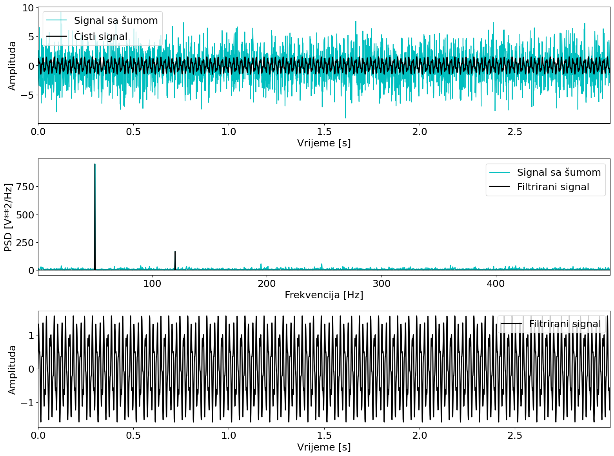

 

### 2. Vremensko-frekvencijska analiza zvuka
FFT nam daje informaciju o tome koje frekvencije postoje u zvuku i koliko su zastupljene, ali problem je u tome što FFT analizira cijeli zvuk kao jednu cjelinu i ne govori nam kada se odredjena frekvencija pojavila. Kod prometnih zvukova to je ograničenje jer zvuk nije konstantan. Npr. vozilo se priblizava senzoru (amplituda raste), prolazi pored senzora(amplituda najveca), udaljava se (amplituda pada). Zbog toga koristimo vremensko-frekvencijsku analizu...

**STFT (Short Time Fourier Transform)**

Problem klasicnog FFT-a je da je signal relativno stacioniran dakle frekvencije koje postoje u signalu postoje kroz cijelo vrijeme, ali realni zvukovi nisu takvi. Npr. kada prolazi auto prvo se cuje tiho pa glasno pa opet tiho. STFT rjesava taj problem tako da dijeli cijeli signal na n manjih dijelova npr. na intervale od 0.05s i za svaki taj interval racuna FFT te ga na kraju spoji u jedan spektogram. (_pogledati primjer STFT_primjer.ipynb_)

  

 

**Spektogram:**
- vizualni prikaz kako se frekvencijski sadrzaj mijenja kroz vrijeme
- svaka točka predstavlja odredjenu frekvenciju u odredjenom trenutku s odredjenom kolicinom energije
- boja predstavlja intenzitet energije (tamnije --> manja, svjetlije --> veca)
- primjer dolje: energija se ne pojavljuje jednoliko kroz cijeli signal, u odredjenim vremenskim intervalima pojavljuju se jace svjetlije linije, neke frekvencije su prisutne citavo vrijeme, a neke se pojavljuju samo kratkotrajno

  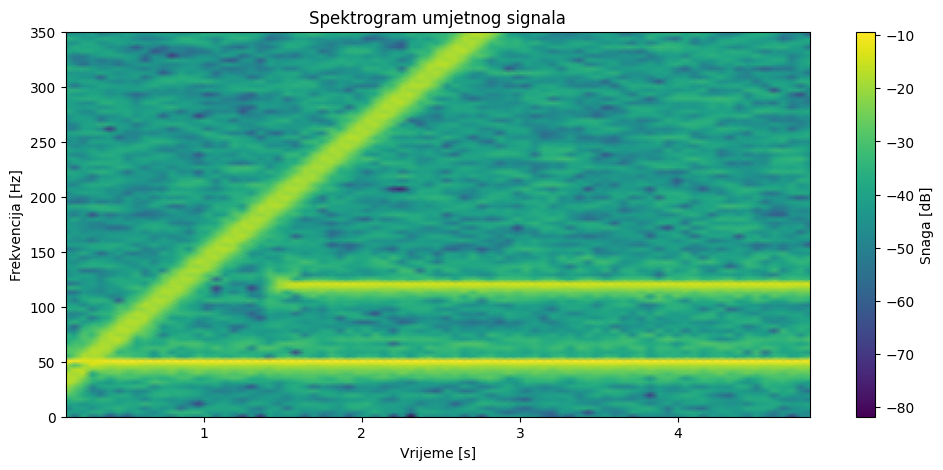

Zasto je spektogram bitan za prometne zvukove?
- razlicita vozila imaju razlicite vremensko-frekvencijske obrasce
- motor - ocekujemo jake niske frekvencije zbog rata motora i harmonike koje se ponavljaju kroz vrijeme
- tramvaj - ocekujemo sirok spektar zbog trenja kotaca i tracnica i promjenjive frekvencije
- bicikl - ocekujemo manju ukupnu energiju, manje izrazene harmonika i vise utjecaja okolisnog suma

  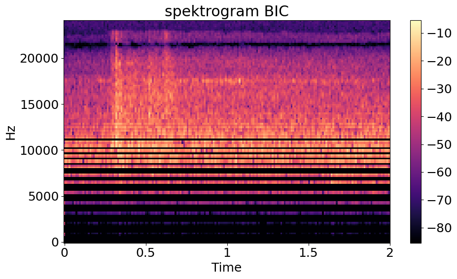

 

### 3. Ekstrakcija značajki

**Literatura:**
Chu et al. (2009) - Environmental Sound Recognition With Time–Frequency Audio Features: https://sail.usc.edu/publications/files/selinachu-taslp2009.pdf (VIDJETI izvori/izvor6.md)

**Najbitnije značajke:**
- RMS
- ZCR
- Spectral Centroid
- Spectral Bandwidth 
- Spectral Rolloff
- Spectral Flux
- MFCC

**Primjer:**

_VIDJETI jupiter file (odsječak _Izvlacenje znacajki za ML_) FFT_primjer.ipynb_

Nakon primjene FFT-a dobiva se frekvencijska reprezentacija signala (spektar), iz koje se mogu izračunati spektralne značajke poput spectral centroida, bandwidtha i rolloffa.

Uz to, iz vremenske domene računaju se značajke poput RMS energije i Zero Crossing Rate-a.

Za naprednije značajke poput MFCC-a koristi se spektrogram (nakon Fourier-a, najcesce STFT), čime se dobiva vremensko-frekvencijska reprezentacija signala pogodna za ekstrakciju kompleksnijih značajki.

### 4. Najbitnije značajke za promet

**RMS:**
- root mean square formula, racuna se iz jacina/amplituda signala
- prosjecna energija odnosno glasnoca signala 
- Koliko je zvuk jak u odredjenom trenutku?
- ne zna je li to bicikl ili auto vec samo pokazuje energiju tj. jacinu signala u tom trenutku
- mozemo zakljuciti u kojem se trenu vozilo priblizava/udaljava

  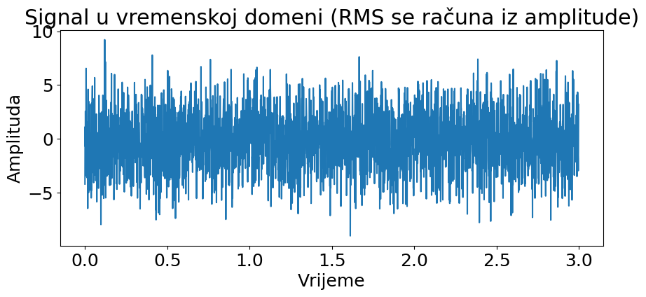

**ZCR:**
- mjeri koliko cesto signal prelazi preko nulte osi
- Koliko brzo signal mijenja pozitivan i negativan smjer?
- normalizirana vrijednost npr. 0.48, u 48% signala se mijenja predznak
- pr. imamo nisku frekvenciju (kamion), ona ce rijetko prelaziti nulu, a visoka (motor) cesce
- koristan za razlikovanje suma i tonova, detekciju kocenja, detekciju naglih sirena

  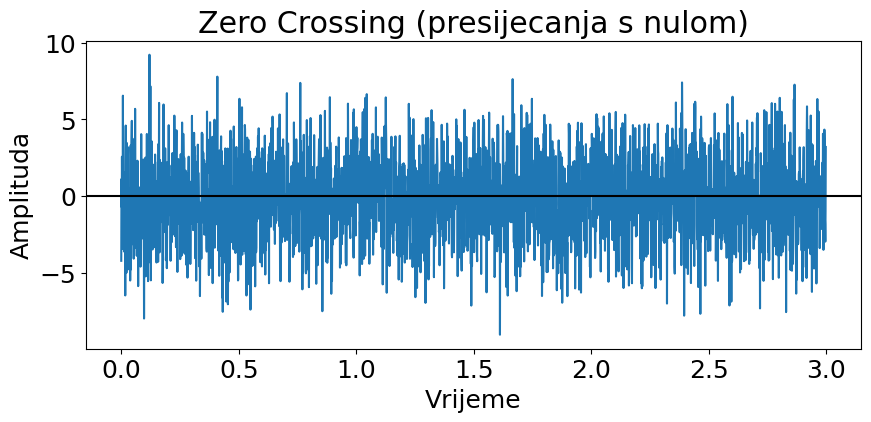

**Spectral centroid:**
- teziste frekvencijskog spektra
- moze se intrpretirati kao svjetlina zvuka ili prosjecna frekvencija energije
- npr. niski centroid vibracije, stalan rad mtoora kod kamiona, a visoki centroid sirena ili motor
- vrlo koristan u razlikovanju tipova vozila i prepoznavanje promjene zvuka

  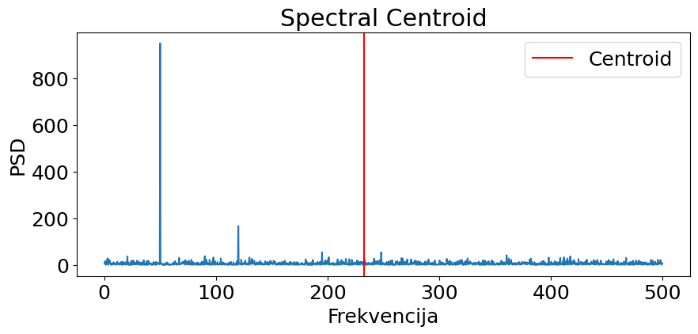

**Spectral Bandwidth:**
- prosjecno odstupanje frekvencija od centroida
- koliko je sitok frekvencijski spektar oko centroida tj. je li zvuk koncentriran oko jedne frekvencije ili rasiren?
- kod prometa: bicikl najcesce ima uske harmonike i manji bandwidth, a promet i buka mnogo izvora pa i siri bandwidth
- korisno je za prepoznavanje "cistog zvuka vozila" vs. prometne buke

  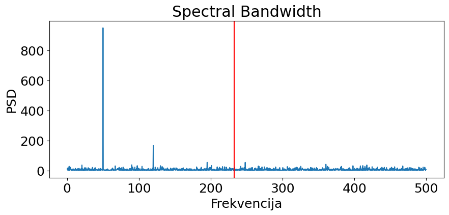

**Spectral Rolloff:**
- na kojoj frekvenciji se nalazi odredjeni postotak ukupne energije
- najcesce se uzima 95% (mjera iz literature - izvor6)
- npr. 95% energije je ispod 50000Hz onda je rolloff = 50000 Hz
- npr. kamion ima manji rolloff jer ima vecinu frekvencija manjih, a motor ili sirene imaju vece ukupne frekvencije i veci rolloff

  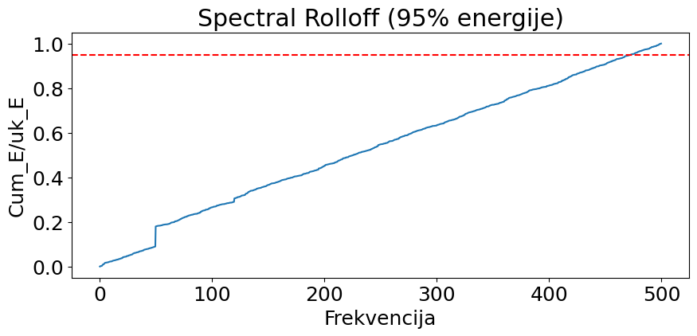

**Spectral Flux:**
- koliko se spektar mijenja kroz vrijeme
- npr. stalan zvuk ima mali flux, a dolazak auta ima veliki flux
- koristi se za detekciju prolaska vozila, promjene brzine, nagle dogadjaje

  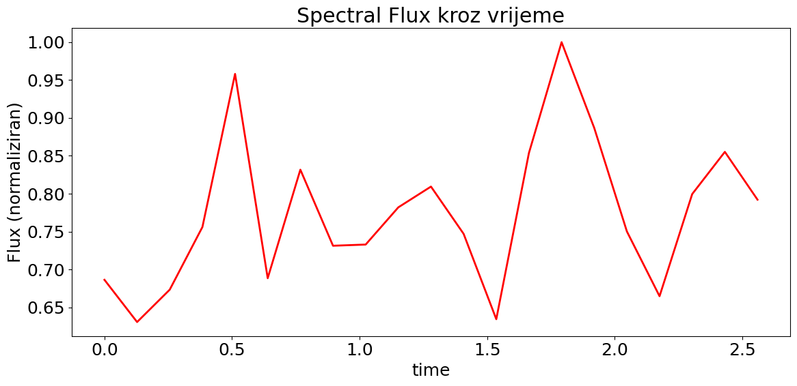

**MFCC:**
- Mel-frequency Cepstral Coefficients
- svojevrsni sazetak mel-spektograma
- mel-spekrogram moze imati 1000 frekvencija, a MFCC to sazme u 13 koeficijenata i izvlaci samo najbitnije
- na primjeru slike dolje prvi koeficijent je jak, on opsiuje energiju signala, dok su ostali slabiji, oni opisuju kako zvuk izgleda, oblik spektra i raspodjelu energije
- npr. bicikl ce sve koef imati male, kamion ce prvi koef imati veliki ostale male, a sirena ce sve imati velike jer je jako jak, kompleksan zvuk
- koristimo mel-spektogram jer zelimo dati fokus frekvencijama koje ljudsko uho bolje percipira
- radimo DCT (Discrete Cosine Transform) na mel-spektogramu --> pretvaramo spektar u "oblik" spektra
- npr. imamo [5, 5, 5, 5, 5] --> DCT ce rec da je c0 jak a c1-c12 slabi jer je signal konstantan i dosadan, a ako imamo [1, 10, 31, 4, 15] visi koeficijanti ce rast
- c0 = ukupna energija, c1 = nagib spektra, c2 = zakrivljenost, c3+ = detalji

  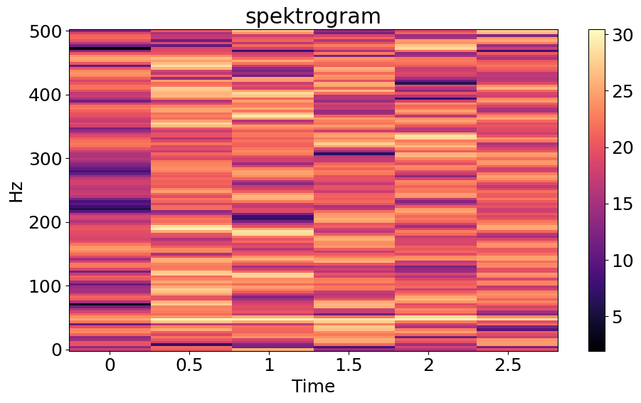

  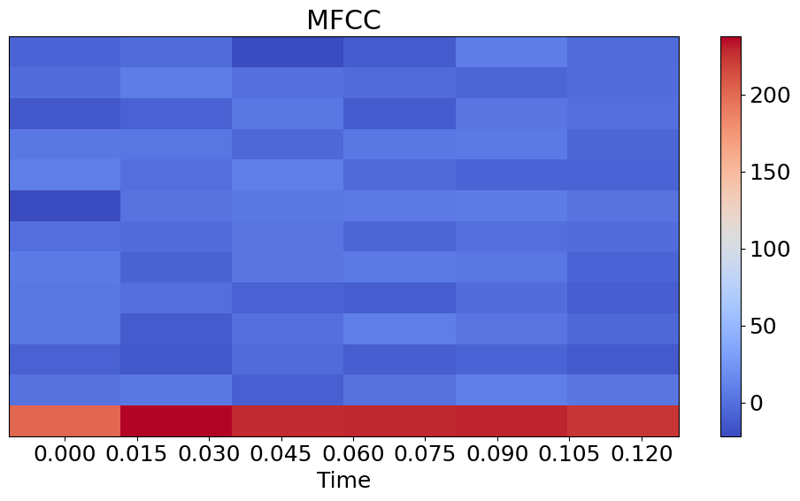

